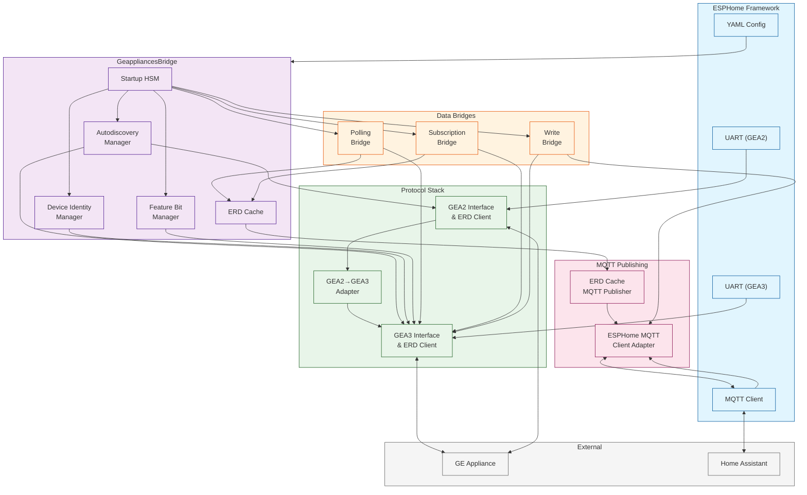
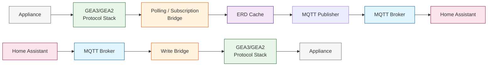

# Architecture

High-level architecture of the GE Appliances Bridge component.

## Module Overview

### Startup HSM

Drives the linear startup sequence: protocol stack → autodiscovery → device ID → MQTT client init → feature bits → bridge init → subscription watch → running. Uses `container_of` pattern for per-instance bridge services.

### Autodiscovery Manager

Self-driving broadcast discovery on GEA3/GEA2 bus. Finds the appliance host address and active protocol. Retries indefinitely.

### Device Identity Manager

Reads appliance type, model number, and serial number ERDs. Assembles a unique device ID string for MQTT topics.

### Feature Bit Manager

Reads and parses appliance API feature bit ERDs (0x0092–0x010D). Produces a filtered ERD set for polling mode. Falls back to full polling if ERD 0x0092 fails.

### ERD Cache

Fixed-size cache (200 entries) with inline storage for small ERDs (≤4 bytes) and heap for larger ones. Change detection at update time. Rate-limited publishing.

### Polling Bridge

Probes a pre-built ERD list, then settles into steady-state polling with budgeted read cycles. Handles appliance loss recovery.

### Subscription Bridge

Manages GEA3 ERD subscription lifecycle. Retains subscription every 30 seconds. Handles host restart detection.

### Write Bridge

Relays MQTT write requests to the ERD client. Two-state HSM (ready/writing) prevents concurrent writes.

### ERD Cache MQTT Publisher

Drains updated ERD cache entries to MQTT. On ESP-IDF, runs in a FreeRTOS background task. On non-ESP-IDF, runs in the main loop with budget parameters.

### ESPHome MQTT Client Adapter

Adapts ESPHome's MQTT client to the `i_mqtt_client` interface. Handles wildcard write topic subscription, pending update queue during disconnects, and hex payload formatting.

## Data Flow

### Read Path (Appliance → Home Assistant)

1. **Protocol Stack** receives ERD data from the appliance via UART
2. **Polling/Subscription Bridge** processes the data and writes to the **ERD Cache**
3. **ERD Cache** detects changes and marks entries as `update_required`
4. **MQTT Publisher** drains updated entries and publishes hex values to MQTT topics
5. **Home Assistant** receives the MQTT messages via the ESPHome integration

### Write Path (Home Assistant → Appliance)

1. **Home Assistant** publishes a write command to `geappliances/{device_id}/erd/0x{ERD}/write`
2. **MQTT Adapter** receives the command via wildcard subscription and fires `on_write_request` event
3. **Write Bridge** forwards the write to the **ERD Client** and reports the result back to MQTT
