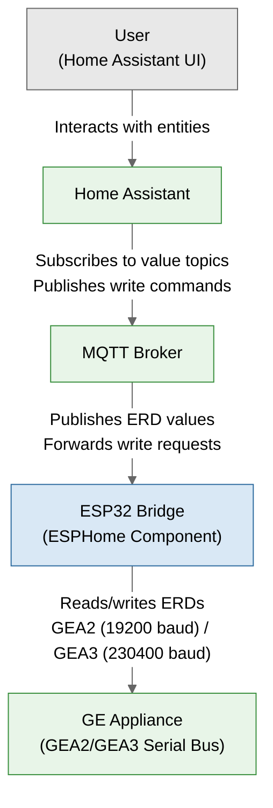
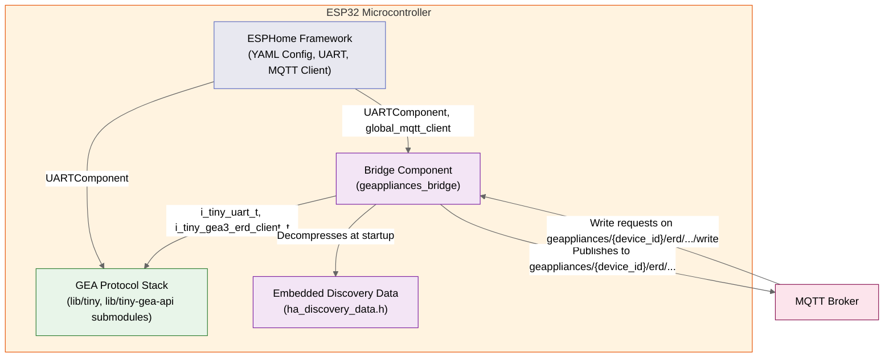

# Architecture Overview

## System Summary

The GE Appliances Bridge is an ESPHome custom component that runs on an ESP32 microcontroller and bridges GE appliances (via GEA2/GEA3 serial bus protocols) to Home Assistant (via MQTT). The component owns the full lifecycle: discovering the appliance on the serial bus, reading its identity, determining which ERDs are available through feature bit parsing, and then continuously publishing those values to MQTT while accepting write commands from Home Assistant. Data flows in both directions — appliance state is published to `geappliances/{device_id}/erd/0x{ERD}/value` topics, and write commands are accepted on `geappliances/{device_id}/erd/0x{ERD}/write` topics.

## C4 Level 1 — System Context

The system has four external actors and one system boundary:

- **User** interacts with Home Assistant's UI to monitor and control the appliance.
- **Home Assistant** creates entities via MQTT discovery and routes user actions to MQTT topics.
- **MQTT Broker** (e.g. Mosquitto) relays messages between the bridge and Home Assistant.
- **GE Appliance** exposes its state and controls over a serial bus using the GEA2 or GEA3 protocol.
- **ESP32 Bridge** (this system) sits between the appliance and the MQTT broker, translating between protocols.

## C4 Level 2 — Container

### Container Descriptions

**ESPHome Framework** provides the runtime environment: YAML configuration parsing,
the `UARTComponent` for serial I/O, the `MQTTClient` for MQTT connectivity, and the
component lifecycle (`setup()`, `loop()`, `dump_config()`).

**Bridge Component** (`components/geappliances_bridge/`) is the custom ESPHome
component. It contains all application logic: startup sequencing (via a state
machine), autodiscovery, device identity, feature bit parsing, data bridges
(polling, subscription, write), the ERD cache, and MQTT publishing. Data-path
modules use C structs with vtables; ESPHome integration layers use C++ classes.

**GEA Protocol Stack** is provided by the `lib/tiny` and `lib/tiny-gea-api` git
submodules. It implements the UART HAL, GEA3 and GEA2 protocol interfaces, ERD
clients, state machines, timers, and event system. The bridge interacts with it
through well-defined C interfaces (`i_tiny_uart_t`, `i_tiny_gea3_erd_client_t`,
`i_tiny_gea2_erd_client_t`, `i_tiny_time_source_t`).

**Embedded Discovery Data** (`ha_discovery_data.h`) is a build-time generated file
containing compressed Home Assistant MQTT discovery entity definitions. Discovery
payloads are published on OTA reboot or when the Discovery Refresh button is
pressed — normal boots skip discovery since topics are retained by the MQTT broker.

## Key Design Decisions

### Single-core constraints

The bridge targets ESP32-C3 and other single-core ESP32 variants. All shared state
between the main loop and the background MQTT publisher task relies on interrupt
disabling (`vPortEnterCritical`/`vPortExitCritical`) rather than mutexes. On
single-core ESP32, critical sections disable interrupts, providing atomicity for
`uint8_t` and pointer accesses. The protocol stack tight loop always runs before
MQTT operations to avoid starving UART processing — a blocking MQTT call could
delay response processing past the appliance's timeout window.

### No dynamic collections

The codebase avoids `std::set`, `std::vector`, and other heap-allocating containers.
Fixed-capacity arrays replace them: the ERD cache holds 200 entries in a static
array; ERD sets use sorted arrays with linear search; the custom ERD list caps at
64 entries; the polling list uses a fixed buffer. This eliminates heap fragmentation
risk and makes memory usage predictable.

### Inline vs. heap data storage

ERD values of 4 bytes or less are stored inline within the cache entry (zero heap
allocation). Larger values use `new[]` for a heap buffer, allocated once at
registration time. Subsequent updates are in-place `memcpy` — no alloc or free.
This keeps the common case (small sensor readings) entirely off the heap.

### Embedded discovery data

Home Assistant MQTT discovery payloads are generated by a build-time pipeline
(`scripts/ha_discovery/run_pipeline.py`), compressed with zlib, and embedded as
`const uint8_t[]` arrays in `ha_discovery_data.h`. At runtime, the bridge
decompresses individual chunks into pre-allocated buffers (peak memory ~45 KB:
8 KB payload + 18 KB decompress + 18 KB line buffer + 1.3 KB sorted ERD array).
No network access or file I/O is needed at runtime. Discovery runs only on OTA
reboot or when the Discovery Refresh button is pressed — normal boots skip it,
as topics are retained by the MQTT broker.

### Task Watchdog avoidance

Long-running operations are split across multiple timer ticks to avoid triggering
the ESP32 Task Watchdog Timer. Feature bit parsing processes ~4 bitmasks per call
across ~5 timer callbacks. The polling bridge budgets MQTT operations per loop
tick. The startup HSM feeds the watchdog between phases.

## Detailed Documentation

| Document | Description |
|---|---|
| [Startup Sequence](./startup-sequence.md) | 8-phase startup HSM sequence diagram |
| [Data Flow](./data-flow.md) | Read path, write path, discovery flow |
| [Module Descriptions](../module_descriptions/) | Lightweight summary for each module |
| [Specifications](../spec/) | Detailed behavioral contracts per module |
